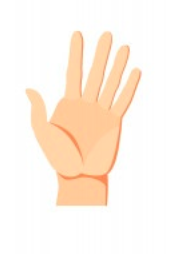
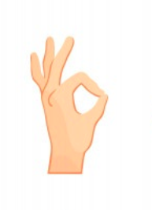
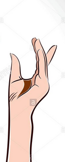

# Virtual Mouse

In this project, we use mediapipe to implement a virtual mouse.
know you can control your laptop as if you are in a movie where you all need control your PC is to wave your hand. .

we use mediapipe that provides landmarks for hands, then we control the mouse by connecting it with the center of the hand in the scene.
we calculate the center of the hand which is (cursor) and we implement the **left and right** button using geometry and the landmarks of the model.

you should keep your hand open like this :


and if you want to press the left button you make the thumb touch the forefinger like this image:


if you want the left button with hold keep the thumb and forefinger close.

if you want to press right button you make the thumb touch the middle finger:


the requirement to run this project :

    1-mediapipe 
    2-scipy
    3-numpy
    4-opencv
    5-pynput

after you install the dependence, open the terminal then change the working directory to the folder where you install the script and then type              

<span style="color:red">$ python virtual_mouse</span>.

the program will start and you can use your hand as a mouse.
if you want to shutdown the program type Ctrl+C in the terminal or print **q** in the windows of the program

<span style="color:red">Note:</span> this code my give erorr in windows os you just need to edit the line 87 by remove the get_resolution() function with the resolution in your device.

```python

```
